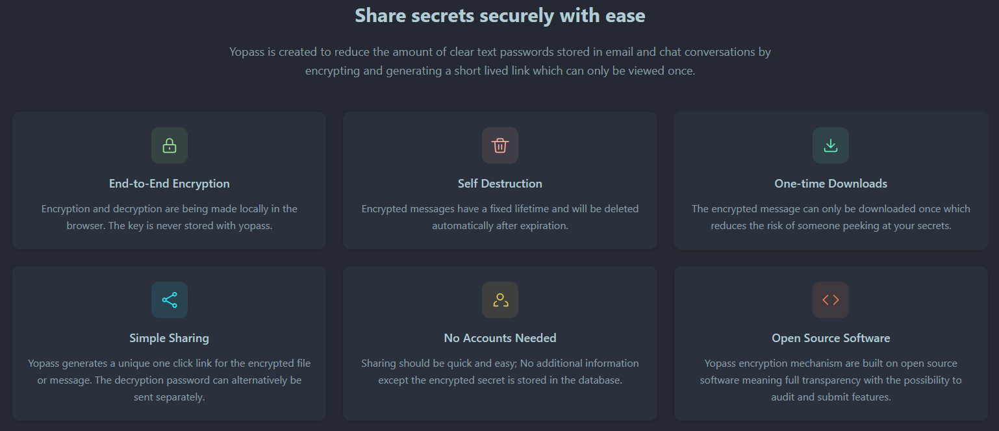

# Purpose of this File

This document lists all changes we made to adapt our **Yopass** deployment to the **Customize** brand.

---

# Frontend Changes

All frontend changes are made in the `website/` directory.

## Local Development Environment

- Your editor/setup is individual.
  - We used an Arch Linux VM and VS Code with a remote connection.
  - Setup guide: [dev-setup.md](/dev-setup.md)
- How to run the frontend: see [CONTRIBUTING.md](/CONTRIBUTING.md)

---

## Change Favicon and Page Title

To change the favicon and page title, edit:

- [website/index.html](/website/index.html)

Favicon assets are located in:

- [website/public/](/website/public/)

---

## Change Logo

To change the logo, edit:

- [Navbar.tsx](/website/src/shared/components/Navbar.tsx)

In this file, update the JSX/HTML part to reference the correct logo filename.

The logo file itself is stored in:

- [website/public/](/website/public/)

---

## Theme Changes

To change the website theme, edit the following files:

- [index.css](/website/src/shared/styles/index.css)
- [theme.ts](/website/src/shared/theme/theme.ts)
- [theme-init.js](/website/public/theme-init.js)

We used the **daisyUI theme generator** (same approach as the upstream repo):  
https://daisyui.com/theme-generator/

Current theme choices:
- **Light theme:** `lofi`
- **Dark theme:** `black`

### How to adjust the theme

1. Set the active theme(s) in `index.css` (daisyUI theme name).
2. Adjust the corresponding theme variables in `theme.ts` and `theme-init.js`.

---

## Remove Feature Explanation Section

To remove the feature explanation section from the webpage, edit:

- [App.tsx](/website/src/app/App.tsx)

We commented out:
- the import of `FeaturesSection`
  - `import FeaturesSection from '@shared/components/FeaturesSection';`
- and the component usage in the JSX
  - `<FeaturesSection />`

---

## Language Changes

To remove languages, edit:

- [index.ts](/website/src/shared/locales/index.ts)
- [LanguageSwitcher.tsx](/website/src/shared/components/LanguageSwitcher.tsx)
- [i18n.ts](/website/src/shared/lib/i18n.ts)

### Steps

1. Comment out/remove the languages you don’t need in `index.ts`.
2. Apply the same removals in `LanguageSwitcher.tsx` and `i18n.ts` so the UI and i18n config remain consistent.

---

# Backend Changes

- No backend changes so far (hopefully we won’t need any 😄).
